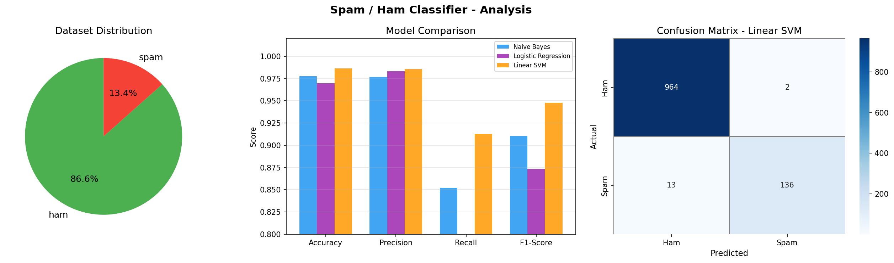

# Spam / Ham Classifier

A machine learning project that classifies SMS messages as **Spam** or **Ham (not spam)** using NLP preprocessing and three classification algorithms.



---

## Features

- Text preprocessing pipeline: lowercasing, digit/punctuation removal, stopword filtering, and Porter stemming
- TF-IDF vectorisation (unigrams + bigrams, 5,000 features)
- Three models compared automatically — best one is saved:
  - Naive Bayes
  - Logistic Regression
  - **Linear SVM** *(best — 98.65% accuracy, 94.77% F1)*
- Clean desktop GUI (Tkinter) to classify any message interactively
- Scrollable prediction history with confidence scores

---

## Dataset

`spam.csv` — SMS Spam Collection Dataset

| Column | Description |
|--------|-------------|
| `v1`   | Label: `ham` or `spam` |
| `v2`   | Message text |

- **5,572** total messages
- **86.6%** Ham · **13.4%** Spam

---

## Project Structure

```
spam-ham-classifier/
├── spam.csv               # Dataset
├── train.py               # Training script
├── app.py                 # Interactive GUI
├── requirements.txt       # Python dependencies
├── results.png            # Model comparison charts
├── models/
│   ├── spam_model.pkl         # Saved best model
│   ├── tfidf_vectorizer.pkl   # Saved TF-IDF vectorizer
│   └── model_name.pkl         # Name of the best model
└── README.md
```

---

## Setup

### 1. Clone the repository
```bash
git clone https://github.com/your-username/spam-ham-classifier.git
cd spam-ham-classifier
```

### 2. Install dependencies
```bash
pip install -r requirements.txt
```

---

## Usage

### Train the model
```bash
python train.py
```
This will:
- Load and preprocess `spam.csv`
- Train and compare Naive Bayes, Logistic Regression, and Linear SVM
- Save the best model to `models/`
- Generate `results.png` with charts

### Launch the GUI
```bash
python app.py
```
Type or paste any message and click **Classify** (or press `Ctrl+Enter`) to instantly see whether it's spam or ham.

---

## Model Results

| Model               | Accuracy | Precision | Recall | F1-Score |
|---------------------|----------|-----------|--------|----------|
| Naive Bayes         | 97.76%   | 97.69%    | 85.23% | 91.04%   |
| Logistic Regression | 96.95%   | 98.32%    | 78.52% | 87.31%   |
| **Linear SVM**      | **98.65%** | **98.55%** | **91.28%** | **94.77%** |

---

## Requirements

- Python 3.8+
- pandas, numpy, scikit-learn, nltk, matplotlib, seaborn, joblib

---

## License

This project is open source and available under the [MIT License](LICENSE).
